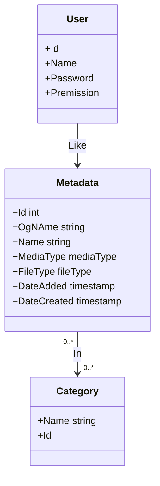

# DB



## Tables

```sql
CREATE TABLE IF NOT EXISTS metadatas (
    id INTEGER PRIMARY KEY AUTOINCREMENT,
    og_name TEXT NOT NULL UNIQUE,
    name TEXT UNIQUE,
    media_type INTEGER NOT NULL,
    file_type TEXT NOT NULL,
    date_added DATETIME DEFAULT CURRENT_TIMESTAMP,
    date_created DATETIME
);

CREATE TABLE IF NOT EXISTS categories (
    id INTEGER PRIMARY KEY AUTOINCREMENT,
    name TEXT UNIQUE NOT NULL
);

CREATE TABLE IF NOT EXISTS users (
    id INTEGER PRIMARY KEY AUTOINCREMENT,
    name TEXT UNIQUE NOT NULL,
    hash_pass TEXT NOT NULL,
    permission INTEGER NOT NULL
);

CREATE TABLE IF NOT EXISTS metadata_category (
    metadata_id INTEGER NOT NULL,
    category_id INTEGER NOT NULL,

    CONSTRAINT meta_cat_pk PRIMARY KEY (metadata_id,category_id),
    UNIQUE(metadata_id,category_id) ON CONFLICT REPLACE

    FOREIGN KEY (metadata_id) REFERENCES metadatas(id),
    FOREIGN KEY (category_id) REFERENCES categories(id)
);

CREATE TABLE IF NOT EXISTS user_fav (
    user_id INTEGER NOT NULL,
    meta_id INTEGER NOT NULL,

    CONSTRAINT  user_fav_pk PRIMARY KEY (user_id,meta_id),
    UNIQUE(user_id,meta_id) ON CONFLICT REPLACE


    FOREIGN KEY (user_id) REFERENCES users(id),
    FOREIGN KEY (meta_id) REFERENCES metadatas(id)
);
```

## Queries

### Getters

#### Media

##### From ID

```sql
SELECT * FROM metadata WHERE id = ?;
```

##### From name

```sql
SELECT * FROM metadata WHERE name = ?;
```

```sql
SELECT * FROM metadata WHERE name CONTAINS ?
```

##### Multiple from media type

```sql
SELECT * FROM metadate WHERE media_type = ?;
```

##### Random from media_type

```sql
SELECT * FROM metadatas WHERE media_type = ? ORDER BY RANDOM() LIMIT 1;
```

##### From media_type and categories

```sql
SELECT m.* FROM metadata_catSELECT m.* FROMegory mc INNER JOIN metadatas m ON mc.metadata_id = m.id WHERE mc.category_id IN (?) GROUP BY metadata_id;
```

##### Random from media_type and categories

```sql
SELECT m.* FROM metadata_category mc INNER JOIN metadatas m ON mc.metadata_id = m.id WHERE mc.category_id IN (?) GROUP BY metadata_id ORDER BY RANDOM() LIMIT 1;
```

##### From User

```sql
SELECT m.* FROM user_fav uf INNER JOIN metadatas m ON uf.meta_id = m.id WHERE uf.user_id = ?;
```

#### Category

##### From media

```sql
SELECT c.* FROM metadata_category mc INNER JOIN categories c ON mc.category_id = c.id WHERE mc.metadata_id = ?;
```

### Setters

#### Media

New media

```sql
INSERT INTO metadata (og_name,name,media_type,file_type,date_created) VALUES (?,?,?,?,?);
```

Update name

```sql
UPDATE metadata SET name = ? WHERE id = ?;
```

#### Category

New category

```sql
INSERT INTO categories (name) VALUES ?;
```

Update category

```sql
UPDATE categories SET name = ? WHERE id = ?;
```

Delete Category

```sql
DELETE FROM categories WHERE id = ?
```

#### User

New User

```sql
INSERT INTO users (name,hash_pass,permission) VALUES (?,?,?);
```

Update user

```sql
UPDATE users SET name = ?, hash_pass = ?, permission = ? WHERE id = ?;
```

Delete user

```sql
DELETE FROM users WHERE id = ?
```

#### Cat Relation

New

```sql
INSERT OR REPLACE INTO metadata_category (metadata_id,category_id) VALUES (?,?);
```

Remove

```sql
DELETE FROM metadata_category WHERE metadata_id = ? AND category_id = ?;
```

Remove from media

```sql
DELETE FROM metadata_category WHERE metadata_id = ?;
```

#### User fav

New

```sql
INSERT OR REPLACE INTO user_fav (user_id,meta_id) VALUES (?,?);
```

Remove

```sql
DELETE FROM user_fav WHERE user_id = ? AND meta_id = ?
```

Remove media

```sql
DELETE FROM user_fav WHERE metadata_id = ?;
```
